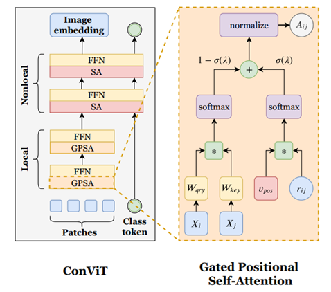

# ConViT

***

> [ConViT: Improving Vision Transformers with Soft Convolutional Inductive Biases](https://arxiv.org/pdf/2103.10697.pdf)

## Introduction

***

ConViT combines e the strengths of convolutional architectures and Vision Transformers (ViTs). ConViT introduce gated positional self-attention (GPSA), a form of positional self-attention which can be equipped with a “soft” convolutional inductive bias. ConViT initialize the GPSA layers to mimic the locality of convolutional layers, then give each attention head the freedom to escape locality by adjusting a gating parameter regulating the attention paid to position versus content information. ConViT, outperforms the DeiT (Touvron et al., 2020) on ImageNet, while offering a much improved sample efficiency.




## Benchmark

***

|        |                   |           |           |    Pynative     |  Pynative  |     Graph      |   Graph    |          |        |
| :----: | ----------------- | :-------: | :-------: | :-------------: | :--------: | :------------: | :--------: | :------: | :----: |
|        | Model             | Top-1 (%) | Top-5 (%) | train (s/epoch) | Infer (ms) | train(s/epoch) | Infer (ms) | Download | Config |
|  GPU   | convit_tiny       |           |           |                 |            |                |            |          |        |
| Ascend | convit_tiny       |  73.66    |  91.72    |                 |            |         240    |            |          |        |
|  GPU   | convit_tiny_plus  |           |           |                 |            |                |            |          |        |
| Ascend | convit_tiny_plus  |    77.00  |  93.60    |                 |            |        247     |            |          |        |
|  GPU   | convit_small      |           |           |                 |            |                |            |          |        |
| Ascend | convit_small      |   81.63   |    95.59  |                 |            |         490    |            |          |        |
|  GPU   | convit_small_plus |           |           |                 |            |                |            |          |        |
| Ascend | convit_small_plus |           |           |                 |            |                |            |          |        |
|  GPU   | convit_base       |           |           |                 |            |                |            |          |        |
| Ascend | convit_base       |           |           |                 |            |                |            |          |        |
|  GPU   | convit_base_plus  |           |           |                 |            |                |            |          |        |
| Ascend | convit_base_plus  |           |           |                 |            |                |            |          |        |


## Examples

***

### Train

- The [yaml config files](../../config) that yield competitive results on ImageNet for different models are listed in the `config` folder. To trigger training using preset yaml config. 

  ```shell
  export CUDA_VISIBLE_DEVICES=0,1,2,3,4,5,6,7
  mpirun -n 8 python train.py -c config/convit/convit_tiny_gpu.yaml --data_dir /path/to/imagenet
  ```


- Here is the example for finetuning a pretrained convit_tiny on CIFAR10 dataset using Adam optimizer.

  ```shell
  python train.py --model=convit_tiny --pretrained --opt=momentum --lr=0.001 dataset=cifar10 --num_classes=10 --dataset_download
  ```

Detailed adjustable parameters and their default value can be seen in [config.py](../../config.py).

### Eval

- To validate the model, you can use `validate.py`. Here is an example for convit_tiny to verify the accuracy of pretrained weights.

  ```shell
  python validate.py --model=convit_tiny --dataset=imagenet --val_split=val --pretrained
  ```

- To validate the model, you can use `validate.py`. Here is an example for convit_tiny to verify the accuracy of your training.

  ```python
  python validate.py --model=convit_tiny --dataset=imagenet --val_split=val --ckpt_path='./ckpt/convit.ckpt'
  ```

