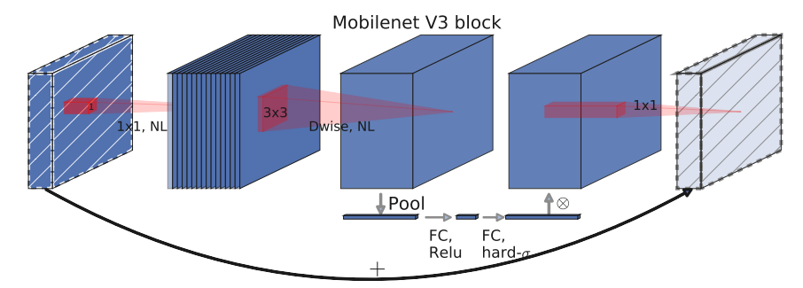

# MobileNetV3
> [Searching for MobileNetV3](https://arxiv.org/pdf/1905.02244v5.pdf)

## Introduction
***

MobileNet v3 was published in 2019, and this v3 version combines the deep separable convolution of v1, the Inverted Residuals and Linear Bottleneck of v2, and the SE module to search the configuration and parameters of the network using NAS (Neural Architecture Search).MobileNetV3 first uses MnasNet to perform a coarse structure search, and then uses reinforcement learning to select the optimal configuration from a set of discrete choices. Afterwards, MobileNetV3 then fine-tunes the architecture using NetAdapt, which exemplifies NetAdapt's complementary capability to tune underutilized activation channels with a small drop.

mobilenet-v3 offers two versions, mobilenet-v3 large and mobilenet-v3 small, for situations with different resource requirements. The paper mentions that mobilenet-v3 small, for the imagenet classification task, has an accuracy The paper mentions that mobilenet-v3 small achieves about 3.2% better accuracy and 15% less time than mobilenet-v2 for the imagenet classification task, mobilenet-v3 large achieves about 4.6% better accuracy and 5% less time than mobilenet-v2 for the imagenet classification task, mobilenet-v3 large achieves the same accuracy and 25% faster speedup in COCO compared to v2 The improvement in the segmentation algorithm is also observed.



## Results
***

| Model                 | Context  | Top-1 (%) | Top-5 (%) | Params (M) | Train T.   | Infer T. | Download  | Config  | Log     |
| --------------------- | -------- | --------- | --------- | ---------- | ---------- | -------- | --------- | ------- | ------- |
| MobileNetV3_large_100 | D910x8-G | 75.14     | 92.33     | 5.51       | 225s/epoch |          | [model]() | [cfg]() | [log]() |
| MobileNetV3_small_100 | D910x8-G | 67.34     | 87.49     | 2.55       | 118s/epoch |          | [model]() | [cfg]() | [log]() |

#### Notes

- All models are trained on ImageNet-1K training set and the top-1 accuracy is reported on the validatoin set.
- Context: GPU_TYPE x pieces - G/F, G - graph mode, F - pynative mode with ms function.  

## Quick Start
***
### Preparation

#### Installation
Please refer to the [installation instruction](https://github.com/mindspore-ecosystem/mindcv#installation) in MindCV.

#### Dataset Preparation
Please download the [ImageNet-1K](https://www.image-net.org/download.php) dataset for model training and validation.

### Training

- **Hyper-parameters.** The hyper-parameter configurations for producing the reported results are stored in the yaml files in `mindcv/configs/mobilenetv3` folder. For example, to train with one of these configurations, you can run:

  ```shell
  # train mobilenetv3_large_100 on 8 GPUs
  export CUDA_VISIBLE_DEVICES=0,1,2,3,4,5,6,7
  pirun -n 8 python train.py -c configs/mobilenetv3/mobienet_v3_large.yaml --data_dir /path/to/imagenet
  ```

  Note that the number of GPUs/Ascends and batch size will influence the training results. To reproduce the training result at most, it is recommended to use the **same number of GPUs/Ascneds** with the same batch size.

- **Finetuning.** Here is an example for finetuning a pretrained mobilenetv3_large_100 on CIFAR10 dataset using Momentum optimizer.

  ```shell
  python train.py --model=mobilenetv3_large_100 --pretrained --opt=momentum --lr=0.001 dataset=cifar10 --num_classes=10 --dataset_download
  ```

Detailed adjustable parameters and their default value can be seen in [config.py](../../config.py).

### Validation

- To validate the trained model, you can use `validate.py`. Here is an example for mobilenetv3_large_100 to verify the accuracy of pretrained weights.

  ```shell
  python validate.py --model=mobilenetv3_large_100 --dataset=imagenet --val_split=val --pretrained
  ```

- To validate the model, you can use `validate.py`. Here is an example for mobilenetv3_large_100 to verify the accuracy of your training.

  ```shell
  python validate.py --model=mobilenetv3_large_100 --dataset=imagenet --val_split=val --ckpt_path='./ckpt/mobilenetv3_large_100-best.ckpt'
  ```

### Deployment (optional)

Please refer to the deployment tutorial in MindCV.


