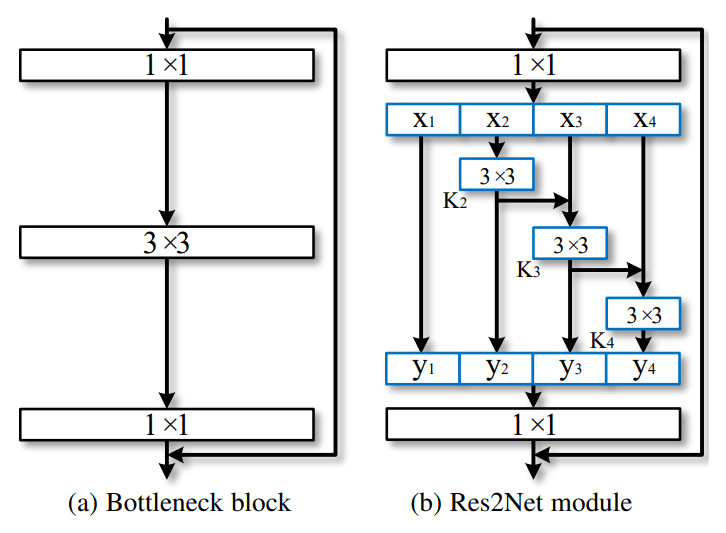

# Res2Net

***

> [Res2Net: A New Multi-scale Backbone Architecture](https://arxiv.org/pdf/1904.01169.pdf)

## 模型简介

***
在本文中，我们通过在一个单个残差模块内构造分层的类残差连接，构建了一种新的CNN模块，我们将该网络命名为Res2Net。Res2Net以更细粒度的方式表示多尺度特征，并且还增加了每个网络层的感受野范围。Res2Net模块还可以融合到目前性能最佳的CNN模型（如ResNet，ResNeXt和DLA）的主干网络中。
我们将这些融合了Res2Net模块的模型在主流的数据集（例如CIFAR-100和ImageNet）上进行了评估，结果表明，相较于基线模型，融合后的模型的性能获得了一致地提升。



## 性能指标

***

| Model          | Context  | Top-1 (%) | Top-5 (%) | Params (M) | Train T.   | Infer T.   | Download  | Config  | Log     |
| -------------- | -------- | --------- | --------- | ---------- | ---------- | ---------- | --------- | ------- | ------- |
| Res2Net50      | D910x8-G | 79.35     | 94.64     | 25.76      | 246s/epoch | 28.5ms/step | [model]() | [cfg]() | [log]() |
| Res2Net101     | D910x8-G | 79.56     | 94.70     | 45.33      | 467s/epoch | 46.0ms/step | [model]() | [cfg]() | [log]() |
| Res2Net50      | D910x8-G | 80.32     | 95.09     | 25.77      | 250s/epoch | 29.6ms/step | [model]() | [cfg]() | [log]() |
| Res2Net101-v1b | D910x8-G | 81.26     | 95.41     | 45.35      | 435s/epoch | 42.4ms/step | [model]() | [cfg]() | [log]() |

#### 备注

- 以上模型均在ImageNet-1K数据集上训练和验证。
- Context: GPU_TYPE x pieces - G/F, G - graph mode, F - pynative mode with ms function.  

## 示例

***

### 训练

- 下面是使用预设的yaml配置文件启动训练的示例.

> [configs文件夹](../../configs)中列出了mindcv套件所包含的模型的各个规格的yaml配置文件(在ImageNet数据集上训练和验证的配置)。

  ```shell
  mpirun -n 8 python train.py --config configs/res2net/res2net_50_gpu.yaml --data_dir /path/to/imagenet
  ```

详细的可调参数及其默认值可以在[config.py](../../config.py)中查看。

### 验证

- 下面是使用`validate.py`文件验证Res2Net50的自定义参数文件的精度的示例。

  ```shell
  python validate.py --config configs/res2net/res2net_50_gpu.yaml --data_dir /path/to/imagenet --ckpt_path /path/to/res2net50.ckpt
  ```
